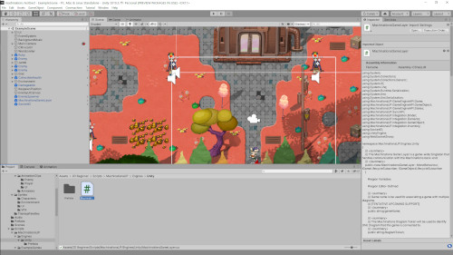
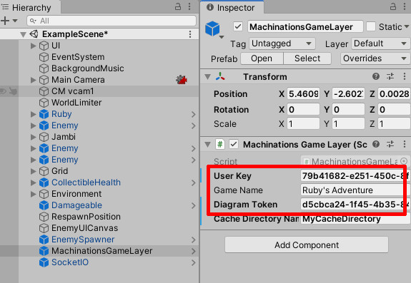
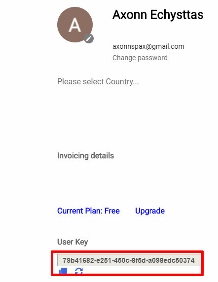
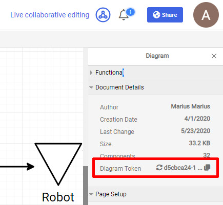

# Machinations UP - Unity Example: Ruby's Adventure*

This repository integrates Machinations UP within Ruby's Adventure, a simple game that is available as a Unity Tutorial.

# Running this example

1. Install the latest version of the Unity 3D Engine by downloading Unity Hub from [here](https://store.unity.com/#plans-individual). Once you installed Unity Hub, you will need to add a Unity 3D install. Stuck? Check our [Detailed Unity Installation Guide](README-unity.md) here.
2. Open Unity 3D and navigate to where you cloned this repo. Upon opening the folder, your Unity Editor should look something like this:  
   
3. In Machinations, create your own copy of our Ruby's Adventure [Machinations diagram](https://my.machinations.io/public/Ruby's-Adventure/0ae75179642ca59cfd5d6eb8685f403cd) by clicking "Add to My Machinations" (top right).
4. In Unity, in the Scene Hierarchy tab, configure the `MachinationsGameLayer` with the correct `User Key` & `Diagram Token`. Here's how to find these:
   1. MachinationsGameLayer inside Unity:  
      
   2. User Key in your Machinations account:  
      
   3. Diagram Token in the Machinations Diagram:  
      
5. Run the game in Unity by pressing the "Play" arrow in the center-top, above the stage.
6. Change the `Player HP` Pool in the Ruby's Adventure diagram. If everything works, Ruby's in-game health should also change.

# Points of Interest (within the example's code)

Classes inside the game use **UP** to get their values from the Machinations diagram, via the `MachinationsGameLayer`. Here are some files where you can see how it all works.

- The `Player HP` Pool and the `Speed` Pool in Ruby's Adventure diagram are mapped inside `RubyController.cs`. See the `MachinationsGameObjectManifest` there.
- Also see the `MachinationsGameObjectManifest` in `Enemy.cs` and `Projectile.cs`.
- Damage for Projectiles is calculated using Formula Elements, see `FormulaElement.cs`. Formulas are parsed inside `MachinationsFormula.cs`. This is a very early implementation of a more complex formula-handling system.
- `EnemySpawner.cs` is where extra enemies are added based on a value retrieved from Machinations.

# Useful Links

Head over to our [Developer Portal](https://developer.machinations.io) for more Machinations tinkering adventures.

Machinations product documentation can be found [here](https://docs.machinations.io).
